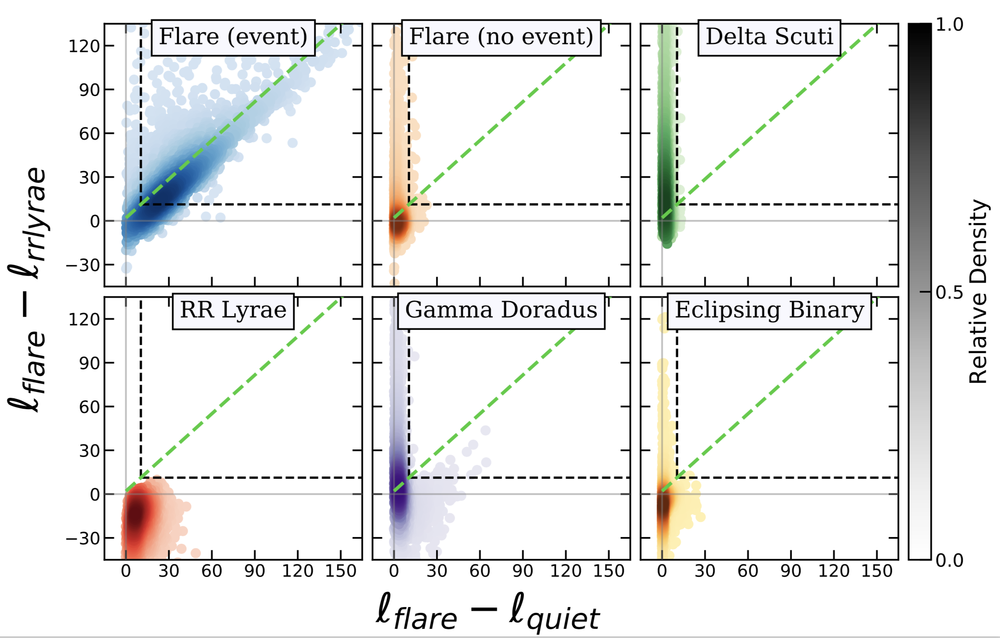

# pyvan
PyVAN is a Python 2.7 package for assessing stellar flare candidate light-curves, especially suited to irregularly sampled light-curves of ground based astronomical surveys. The software takes a set of light-curve templates corresponding to both a type of variable you want to identify and to common contaminants. It then searches each candidate light-curve over a range of plausible template paramaters for the fit of each template most likely to have produced the observations. By comparing the likelihoods of these best-fits with one another, users can identify the light-curves that are both most likely to result from the astrophysical phenomenon of interest, and least likely to result from contaminants. By default, the software fits for flare, RR Lyrae, and quiet templates, and was created for identification of flares. However, additional functions allow capabilities for any templates that might interest you --- the docstrings for the most important (IMO) functions are pretty thorough and should help in this respect. However, I'll have some relevant examples added ASAP.

A plot of the differences of log-likelihoods for fits of the three previously mentioned templates to flare and contaminant data simulated by inducing ground-based survey quality and sampling in Kepler light-curves of known identity:

The black dashed line denotes the threshold above which < 1% of any contaminant population is included, retaining ~66% of all simulated flare light-curves containing an event. The corresponding paper has been submitted, and is pending review --  but can be viewed online: https://arxiv.org/abs/1903.03240

--------------------------------------------------------------------
## Installation

Just clone this repository and install via 'setup.py', i.e. via command line:

> `git clone https://github.com/kdlawson/pyvan`

> `cd pyvan`

> `pip install .`

## Example

A quick use example for the software (or see more in-depth examples [here](examples/)):

--------------------------------------------------------------------

    import glob 
    import numpy as np 
    import pyvan

    lc_dir = '/my_lightcurves/' # Directory containing 3 column light-curve files (columns of time in days, mag, and mag error)
    
    lc_files = glob.glob(lc_dir+'*.dat')
    
    lightcurves = []
    
    for lc_file in lc_files:
      lightcurves.append(np.genfromtxt(lc_file, skip_header=True, names=['mjd', 'mag', 'magErr']))

    tar_fits = pyvan.fit(lightcurves, n_cores=3, filt='g')
    
    # Fits all entries in 'lightcurves' for default templates using 3 processor cores and g-band filters where applicable (RR Lyrae in this case)
    
--------------------------------------------------------------------

The result is a dictionary containing an entry with fit information for each of the light-curves in the list "lightcurves". For example, tar_fits[0]['flare'] contains information for the 1st light-curve's flare fit, while the comparison metrics for those fits is found in tar_fits[0]['rel_fit'] (where 'flare-quiescent' is the difference of the best-fit log likelihoods for those templates). See example notebooks or documentation for more information regarding the structure and contents of PyVAN's products.

--------------------------------------------------------------------

'tar_fits' can be saved for later using pickle:

    import pickle
    pickle.dump(tar_fits, open('/my_dir/tar_fits.p','wb'))

--------------------------------------------------------------------

And can be loaded later with:

    import pickle
    tar_fits = pickle.load(open('/my_dir/tar_fits.p', 'rb'))

--------------------------------------------------------------------

Happy to help if anyone has further questions.
